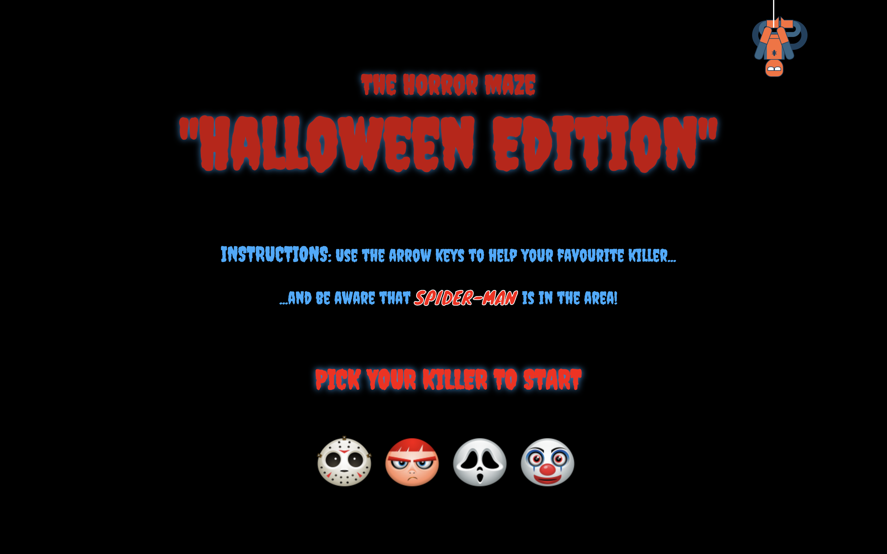
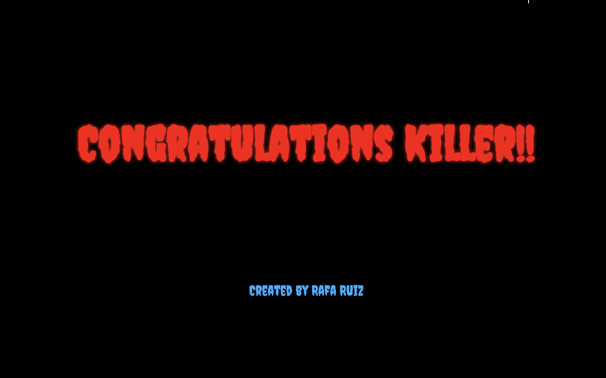

# wdi-project-one

# The Horror Maze: 'Halloween Edition'

# Grid
It is a grid based game...
where you move a character...


# Characters

the main character (killer) is moving on the board


the most famous serial killers from the movies.

# Aim of the game
The player has a certain amount of time to complete each level, the aim is  killing all pedestrians on the level and scape from Spiderman.

(Future) The player has a certain amount of time to complete each level, but more time may be gained by collecting bonuses or by murdering pedestrians.
...and scape from Spiderman...


# Styling and Idea
As Halloween is coming...time for scary things, games, movies and some cool stuff.
using google fonts, css animations, music and sounds to built the creepy...

## Subtitle

Link to [Google](www.google.com)

# Game screenshots






# (Bullets) Wins

*
* How are you?

# Approach Taken

1. creating the grid
1. work on key events with JavaScript
1. adding the characters
1. working with javascript for the interactions and movements
1. Adding spiderman
1. Creating the welcome page
1. ...


# Code Snippets
`function (some code)`
```
[javascript] `function(){
  //some code
  }`
```

# Technologies Used

* HTML5 with HTML5 audio
* CSS3 with animation
* JavaScript (ECMAScript 6)
* Git
* GitHub
* Google Fonts
* Atom
* ...

# Future Features

* more levels
* more superheroes and more 'killers'
* increase the difficulty level
* better scenarios
* game over page
* a side showing your kills and getting points depending on the target.
* ...
