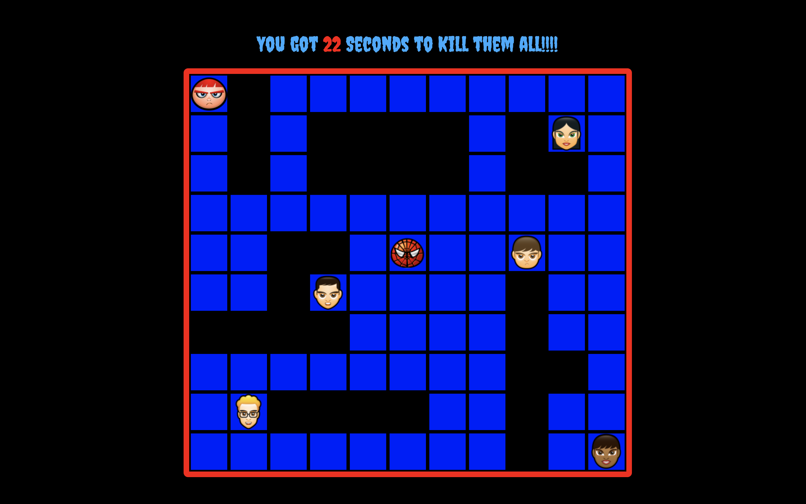
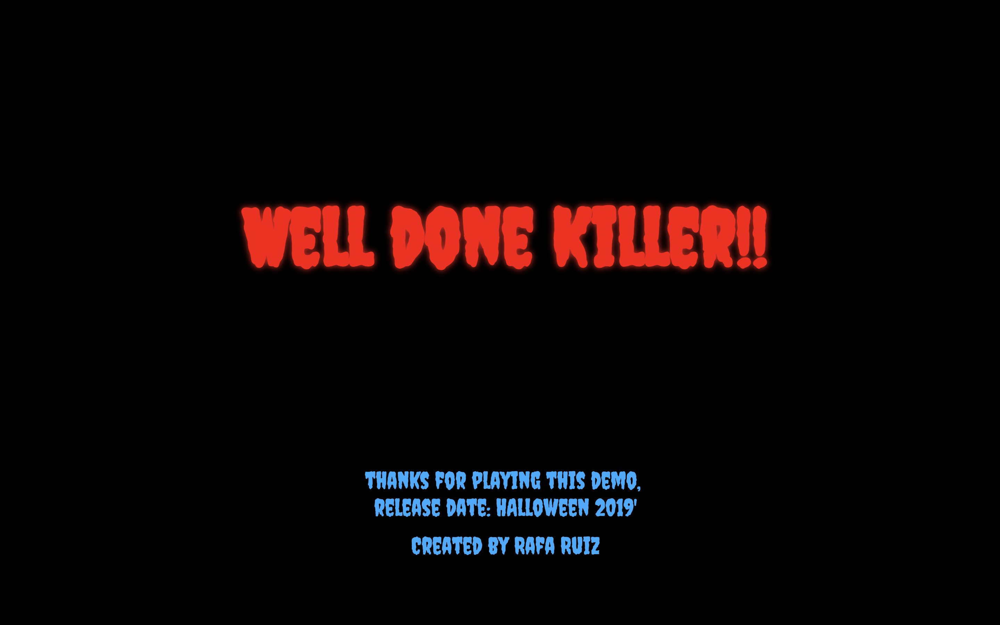

# WDI Project 1 -The Horror Maze: 'Halloween Edition'


## Overview

The Horror Maze, 'Halloween Edition' was my first project as part of the General Assembly Web Development Immersive course. The objective was to build a single page grid based game using HTML5, CSS3 and JavaScript.

Go to [Gameplay](https://rafcoding.github.io/wdi-project-one/) and [GitHub](https://github.com/Rafcoding/wdi-project-one).

## Timeframe

1 week (October 2018)

# Technologies Used

* HTML5 with HTML5 audio
* CSS3 with animation
* JavaScript (ECMAScript 6)
* Git
* GitHub
* Google Fonts
* Atom

# Aim of the game
The player has a certain amount of time to complete each level, the aim is  killing all pedestrians on the level and scape from Spiderman.

# Styling and Idea

As Halloween was coming...time for scary things, games, movies and some cool stuff.

I though to do a game based on that theme, using horror characters and scary music and sounds.

I have used different google fonts, css animations, music and sounds to achieve that.

##  Characters

#### Jason, Chuckie, Scream and Pennywise...

   

The most famous serial killers from the horror movies.

They can move around using the keyboard arrow keys. When they walk over a pedestrians a short scream happens meaning the kill and the pedestrians are removed from the game.

#### ... and Spiderman


As a Superhero trying to save the pedestrians.


Spiderman moves randomly and he is able to go anywhere on the grid, streets and roofs.


## Game screenshots







## Wins and Blockers

Adding the audio, animation, images and timing events really brought the game to life. The addition of Spiderman chasing the killer was also very rewarding.

As my first project, it was a challenge and big win building the game itself.

Although it has few bugs i am happy with the end product.

## Approach Taken

1. creating the grid
1. work on key events with JavaScript
1. adding the characters
1. working with javascript for the interactions and movements
1. Adding Spiderman
1. Creating the welcome page
1. ...


##Code Snippets
`function (some code)`

```
[javascript] `function(){
  //some code
  }`
```
```
window.addEventListener('keydown', function(event) {

  if (event.which === 38) {
    event.preventDefault();
    moveUp();
  } else if (event.which === 40) {
    event.preventDefault();
    moveDown();
  } else if (event.which === 37) {
    event.preventDefault();
    moveLeft();
  } else if (event.which === 39) {
    event.preventDefault();
    moveRight();
  }
});
```


## Future Features

* More levels or scenarios.
* The player has a certain amount of time to complete each level, but more time may be gained by collecting bonuses or by murdering pedestrians...and scape from Spiderman...
* pedestrians moving around.
* more sounds and more 'killers'
* increase the difficulty level in each scenario.
* a side showing your kills and getting points depending on the target.
