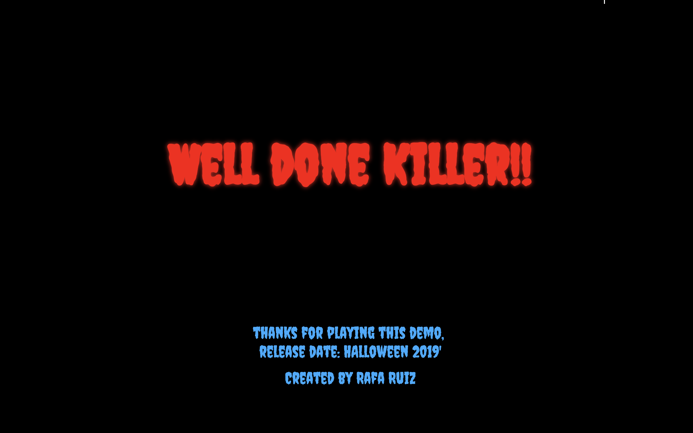

# WDI Project 1 -The Horror Maze: 'Halloween Edition'


## Project Overview and Motivation

As halloween was about I though to do a game based on that theme.

The Horror Maze, "Halloween Edition" was my first project as part of the General Assembly Web Development Immersive course. The objective was to build a single page grid based game using HTML5, CSS3 and JavaScript.

Web Site Heroku. GitHub Repo.

## Timeframe

1 week (October 2018)

# Technologies Used

* HTML5 with HTML5 audio
* CSS3 with animation
* JavaScript (ECMAScript 6)
* Git
* GitHub
* Google Fonts
* Atom


# Grid
It is a grid based game...
where you move a character...


# Characters

The most famous serial killers from the horror movies.


# Aim of the game
The player has a certain amount of time to complete each level, the aim is  killing all pedestrians on the level and scape from Spiderman.


# Styling and Idea
As Halloween is coming...time for scary things, games, movies and some cool stuff.
using google fonts, css animations, music and sounds to built the creepy...


## Subtitle

Link to [Google](www.google.com)

# Game screenshots





# Wins and Blockers

As my first project, it was a challenge and big win building the game itself.

Although it has few bugs i am happy with the end product.

# Approach Taken

1. creating the grid
1. work on key events with JavaScript
1. adding the characters
1. working with javascript for the interactions and movements
1. Adding Spiderman
1. Creating the welcome page
1. ...


# Code Snippets
`function (some code)`

```
[javascript] `function(){
  //some code
  }`
```
```
window.addEventListener('keydown', function(event) {

  if (event.which === 38) {
    event.preventDefault();
    moveUp();
  } else if (event.which === 40) {
    event.preventDefault();
    moveDown();
  } else if (event.which === 37) {
    event.preventDefault();
    moveLeft();
  } else if (event.which === 39) {
    event.preventDefault();
    moveRight();
  }
});
```


# Future Features

* more levels
* The player has a certain amount of time to complete each level, but more time may be gained by collecting bonuses or by murdering pedestrians...and scape from Spiderman...
* more superheroes and more 'killers'
* increase the difficulty level in each scenario.
* a side showing your kills and getting points depending on the target.
